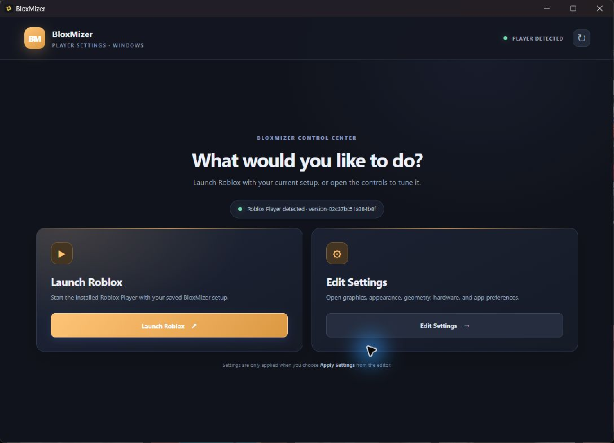
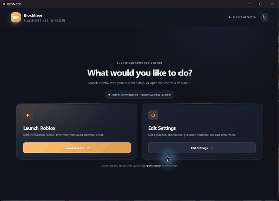
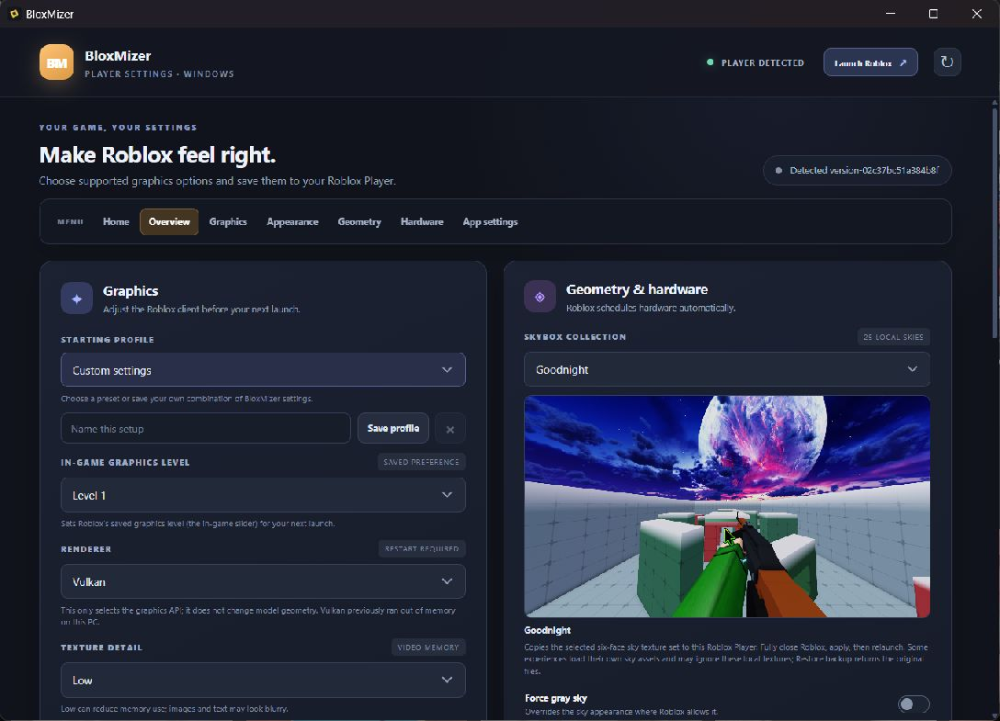

# BloxMizer 1.0.0 for Windows

BloxMizer sets supported Roblox Player graphics preferences before Roblox starts. It also backs up the client files it changes and can restore those backups.

Website: [adhrit-bloxmizer.onrender.com](https://adhrit-bloxmizer.onrender.com/)

## App preview

[Watch the MP4 walkthrough](media/bloxmizer-tour.mp4)

## Install

- **Setup installer:** [BloxMizer-1.0.0-Windows-Setup-x64.exe](BloxMizer-1.0.0-Windows-Setup-x64.exe)
- **Portable app:** [BloxMizer-1.0.0-Windows-x64.exe](BloxMizer-1.0.0-Windows-x64.exe)

## Use BloxMizer

1. Open BloxMizer and choose **Edit Settings**.
2. Select a starting profile or customize the settings.
3. Fully close Roblox Player, then choose **Apply Settings**.
4. Launch Roblox. The saved settings load on its next start.

Choose **Restore backup** in the editor to restore Roblox's original settings and sky textures.

## Features

- **Profiles:** Performance, Low polygon (CSG), Balanced, Visual quality, Roblox defaults, and custom saved profiles.
- **Graphics level:** saves Automatic or level 1–10 for the Roblox graphics slider.
- **Renderer:** Default, Direct3D 11, or Vulkan, when supported by Roblox.
- **Texture detail:** Default, Low, Medium, or High.
- **Anti-aliasing:** optional 2x, 4x, or 8x MSAA; more samples may reduce performance.
- **FRM quality:** optional forced levels 1–21. Roblox normally adjusts rendering quality automatically; forcing a level can lower FPS.
- **Terrain grass distance:** Roblox default, about 100 studs, or Off for animated grass on Roblox Terrain. Custom foliage is unaffected.
- **CSG / union detail:** Performance, Low polygon, Ultra low, or Visual quality. It does not simplify MeshParts or avatars; Ultra low can hide nearby detail.
- **Sky collection:** 25 bundled choices with previews and Force gray sky. Some experiences replace the selected sky themselves.
- **CPU priority:** optional Above normal process priority while BloxMizer is running; it does not assign CPU cores or guarantee more FPS.
- **GPU preference shortcut:** opens Windows Graphics settings so you can choose a GPU for Roblox Player.
- **Roblox link handling:** optionally routes Windows `roblox-player` links through BloxMizer.
- **Backups:** restore the Roblox config and sky files that BloxMizer changed.
- **App appearance:** accent color, compact layout, and reduced motion.

## Where it saves settings

BloxMizer detects the newest Roblox Player under `%LOCALAPPDATA%\Roblox\Versions`. Graphics flags go to that version's `ClientSettings\ClientAppSettings.json`. The graphics level goes to `%LOCALAPPDATA%\Roblox\GlobalBasicSettings_13.xml`. Sky choices replace six Roblox sky texture files after making backups.

Fully close Roblox before applying settings. They load on the next launch. After Roblox updates, apply the settings again for the new version.

## What it cannot do

Roblox may ignore local flags or change how they work. BloxMizer cannot force Roblox to use every CPU core or a particular GPU, remove an FPS cap, or guarantee higher FPS. Renderer selection does not change model geometry. Grass distance affects built-in terrain grass only, and CSG detail affects unions rather than MeshParts. See Roblox's [Fast Flag allowlist announcement](https://devforum.roblox.com/t/allowlist-for-local-client-configuration-via-fast-flags/3966569/).

## Credits

- [robbehy](https://www.youtube.com/@robbehy) for inspiration for the sky collection and its screenshots.
- VoidStrap for reference and inspiration on Roblox optimization settings.
